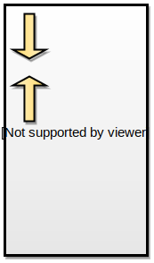

# Clase 1
---
## Temario

* Historia de C
* Características generales
* Compilación de un programa
* Tipos de datos
* Variables
* Operadores
* Estructura de un programa

***
# Historia de C
---
## Un poco de historia

* Desarrollador entre 1969/1973 por Dennis Ritchie 
* A fines de 1974 fue utilizado para reimplementar el sistema operativo Unix 
* En 1980 ANSI comenzó la estandarización del lenguaje
* A partir de 1990, ISO adopta ANSI C en el estándar conocido como C89/C90
* A fines de los '90s, se revisa el estándar y surge C99 que incorpora nuevas
  características que fueron revolucionarias

---
## Quiénes lo utilizan

* Nuevos lenguajes mantienen expresiones similares en su sintaxis, como
por ejemplo: C++, PERL, Javascript, Java, PHP, entre otros.
* En el desarrollo de sistemas operativos, bases de datos, juegos,
compiladores, nuevos lenguajes, etc.

<p class="fragment">
<em>Además, programar en C, motiva la adopción de buenas prácticas de programación</em>
</p>
---
## Características

* Combina elementos de alto nivel con características de bajo nivel
* Es un lenguaje pequeño, con una sintaxis simple
* Es orientado a expresiones
* Es base de lenguajes modernos
* Código *"portable"*
* Extensible mediante el uso de librerías
* Contempla sólo tipos de datos básicos

---
## Características

* No es orientado a objetos
* No es un lenguaje de bajo nivel
* No provee primitivas de entrada salida
* No realiza comprobación de errores en tiempo de ejecución
***
***
# Proceso de compilación
---
## Hola mundo!

Asumiendo el archivo se llama `hola_mundo.c`

```c
#include <stdio.h>

int main() 
{
    printf("Hola Mundo\n");
    return (0);
}
```

```bash
$ gcc hola_mundo.c -o hola_mundo -Wall
```

<small>
[Descargar ejemplo](images/ejemplos/01/01-hello-world.c)
</small>

---
## Fases en la creación de un programa


***
***
#  Tipos de datos
---
## Tipos de datos

* Definen la representación interna de una variable y un conjunto de valores
posibles.
* La definición original de C era sumamente permisiva respecto de las
conversiones de tipos
  * Actualmente se requiere una adecuada declaración y conversión explícita
* Tipos de datos en C:
  * **Básicos:** caracteres, enteros y números de punto flotante, punteros. 
  * **Derivados:** arreglos, estructuras y uniones. 

---
##  Tipos de datos básicos
| Tipo      | Descripción             | 32bits| 64bits|
| --------  |:-----------------       | -----:| ----: |
| `char`    | caracter                | 8     |8      |
| `short`   | entero corto con signo  | 16    | 16    |
| `int`     | entero con signo        | 32    | 32    |
| `long`    | entero largo con signo  | 32    | 64    |

---
##  Tipos de datos básicos
| Tipo      | Descripción             | 32bits| 64bits|
| --------  |:-----------------       | -----:| ----: |
| `float`   | flotante simple         | 32| 32|
| `double`  | flotante doble          | 64| 64|
| `pointer` | puntero a una posición de memoria | 32| 64|
| `void`    | idem `char`. Empleado para tipos genéricos |-|-|

---
## Constantes literales: Punto Flotante

La expresión:

```c
3.45 – 1.2e+34
```

Significa **3.45 - (1.2*10<sup>34</sup>)**


---
## Constantes literales: Enteros

| Base | Representación|
|:---         |---: |
| Decimal     |  14 |
| Hexadecimal | 0xE |
| Octal       | 016 |

---
## Constantes literales: Enteros

### Calificadores o modificadores

Determinan si el entero es con signo, corto o largo:

| Literal | Representación  | Significado             |
| ---     | :---:           |:---:                    |
|`23L`    | decimal         |`23 long int`           |
|`23LU`   | decimal         |`23 unsigned long int`  |
|`023LU`  | octal           |`19 unsigned long int`  |
|`0XFUL`  | hexadecimal     |`15 unsigned long int`  |

<small>
[Descargar ejemplo](images/ejemplos/01/02-0xful.c)
</small>
---
## Constantes literales: Char

* Permiten representar letras mayúsculas, minúsculas, números de 0 a 9, signos de
puntuación, no imprimibles, etc.
* Se manejan como `char` o `int` (valor [ASCII](http://ascii.cl/es)) de forma indistinta

---
## Constantes literales: Char
### Las comillas

* **Comilla simple:** usada para un char
* **Comilla doble:** usada para un string

---
## Constantes literales: Char
### Ejemplos

|`char`  | Significado                        |
|---     |---                                 |
| `'A'`  | Letra A mayúscula                  |
| `'\n'` | Salto de linea. Equivale a `'\x0A'`|
| `'\0'` | Fin de string o `NULL` o cero      |
| `'\x0A'` | Idem `'\n'` en hexadecimal       |
| `'\012'` | Idem `'\n'` en octal             |
---
## Constantes literales: Char
### Los strings

* Los strings se representan con **comillas dobles**.
* Por ello, **`'A'` no es lo mismo que `"A"**
* El string "A" es un arreglo con los siguientes elementos: `['A','\0']`

---
## Constantes enumerativas: Enum

Se utilizan para enumerar una lista de valores constantes

```c
enum estado_civil {casado, soltero, viudo, separado, divorciado, NSNC,
estado_civil_TOPE };

enum meses { ENE=1, FEB, MAR, ABR, MAY, JUN, JUL, AGO, SEP, OCT, NOV, DIC,
meses_TOPE };

```

<small>
[Descargar ejemplo](images/ejemplos/01/03-enum-sample.c)
</small>

---
## Punteros
* Representan una variable que apunta a otra
* Contienen la dirección de memoria de otra variable
* Un puntero consta de dos partes:
  * La dirección apuntada
  * El contenido apuntado.

---
### Conceptos del manejo de memoria

* Cada posición de memoria:
  * Almacena un byte
  * Es accesible mediante una dirección específica
* Las direcciones de memoria son consecutivas
* Dependiendo del tipo de memoria al que apunte un puntero, la
  memoria se accederá a todos los bytes que representen ese tipo.
* Los programas comparten el espacio de direcciones con el sistema operativo
* Los datos del programa y el programa se almacenan en memoria al ser ejecutados

---
### Distribución de la memoria

* La memoria de un programa en ejecución se organiza en segmentos
  * **Text segment:** código compilado  del programa
  * **Stack segment:** almacena *variables automáticas* declaradas en funciones
  * **Heap segment:** almacena *datos dinámicos*



---
### Distribución de la memoria

```c
int x;        /* Variable global */

int main() {

  int y;      /* Variable automatica */

  char *str;  /* Variable automatica cuyo valor es la posición
               * de memoria de otra variable
               */

  str = malloc(50); /* Es en esta instancia donde se aloca memoria
                     * en la heap 
                     */
  ...
}
```
---
## Esquema de memoria

```c
int main( ) {

  int v_entero;
  int *p;
  v_entero = 7;
  p = &v_entero;
  ...
```
---
## Esquema de memoria: gráfico

<table>
<tr>
<td class="fragment">

</td>
<td class="fragment">

</td>
<td class="fragment">

</td>
</tr>
</table>

***
***
# Variables
---
## Variables

* Representa una posición de memoria que se le asigna un nombre y posee un cierto tipo de
datos
* Se usa en expresiones para realizar cálculos
* Deben ser declaradas antes de ser utilizadas.
* El operador `&` permite acceder a la dirección de la variable
* Son sensibles a mayúsculas y minúsculas

---
## Variables: inicialización

Es posible realizar la incialización en la declaración

```c
int x = 9;
int j, x = 12;
int j = 12, x;
char c = 'x';
const int x = 12;
char c, linea[80];
char nombre[] = "Juan";
const char mensaje[] = "Saludos!!";
```

<p class="fragment">
<em>Recordar que las últimas dos cadenas son arreglos de <strong>char</strong> terminadas en
<strong>'\0'</strong></em>
<pre class="fragment">
<code class="c">
['J','u','a','n','\0']
['S', 'a', 'l', 'u', 'd', 'o', 's', '!', '!', '\0']
</code>
</pre>
</p>

---
## Conversiones de tipos

* Es posible *mezclar* tipos de datos en una expresión:
  * **Conversiones explícitas:** `(tipo) expresion`
  * **Conversiones implícitas:** `lvalue = rvalue`
---
## Conversiones implícitas

* De `int` a `char` se eliminan los bits de orden superior
* De `float` a `int` se trunca la parte fraccionaria
* De `double` a `float` se aplica redondeo
* Los enteros de mayor magnitud (como `long`) se convierten en `short` o en `char`
eliminando los bits de orden superior

---
## Conversiones implícitas: Reglas

* Si cualquier operando es `long double`, se convierte el otro a `long double`
* De otra manera, si cualquier operando es `double`, se convierte el otro a `double`
* De otra manera, si cualquier operando es `float`, se convierte el otro a `float`
* De otra manera, si cualquier operando es `long`, se convierte el otro a `long`
* De otra manera, si cualquier operando es `int`, se convierte el otro a `int`
* Finalmente, se convierte `char` a `short`

